# Hands-on: Start New STM32 Project

1. After running STM32CubeIDE, STM32CubeIDE Launcher appears as shown below:
   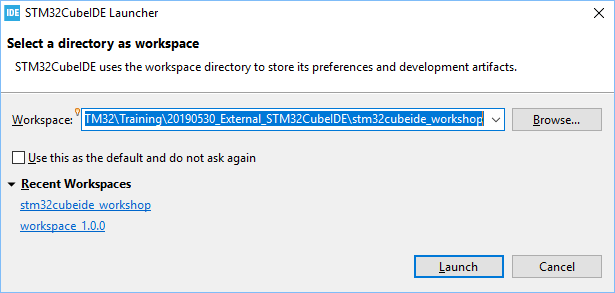

   Please select a location to store the workspace or simply use the default workspace for convenient. After pressing "Launch" button, the following will appear:
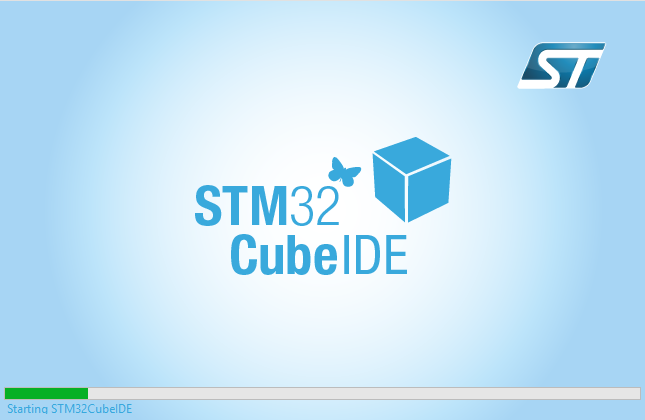
   
   Suggest to select "NO" for the following override setting for file association for **.cproject** file if you have some other Eclipse-base IDE installed in your system:
   
   Suggest to select "NO" for the following override setting for file association for **.project** file if you have some other Eclipse-base IDE installed in your system:
   
   
   
   
2. After getting into "Information Center", please press "Start new STM32 project" button on the left:
   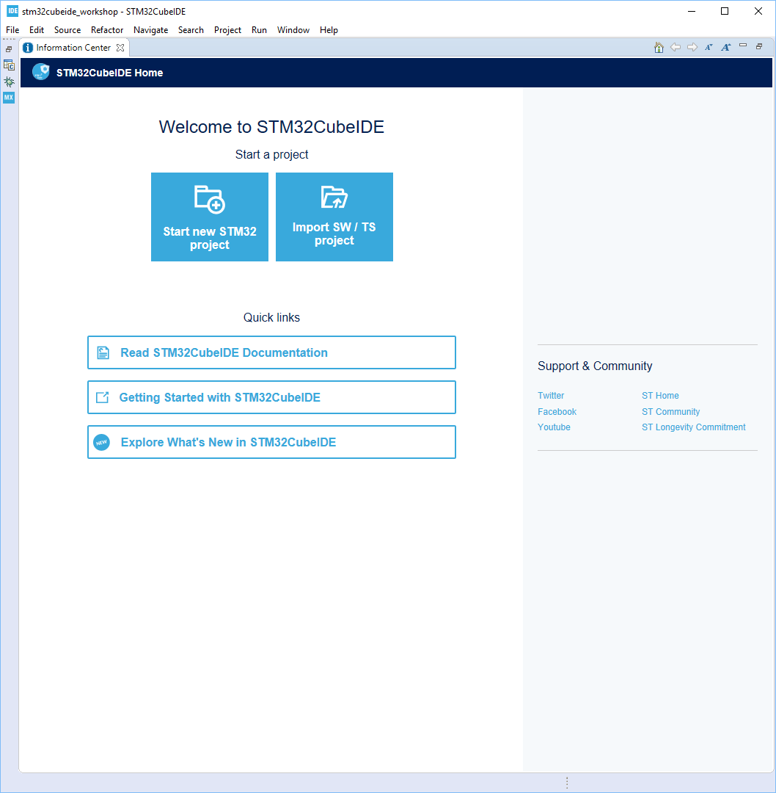
   The following will pop up and may take some time:
   
   
   
   
3. Select "Board Selector" and type "34F746" in "Part Number Search" to quickly sort out the board we want. Click 32F746DISCOVERY in Board List and then press "Next" button:
   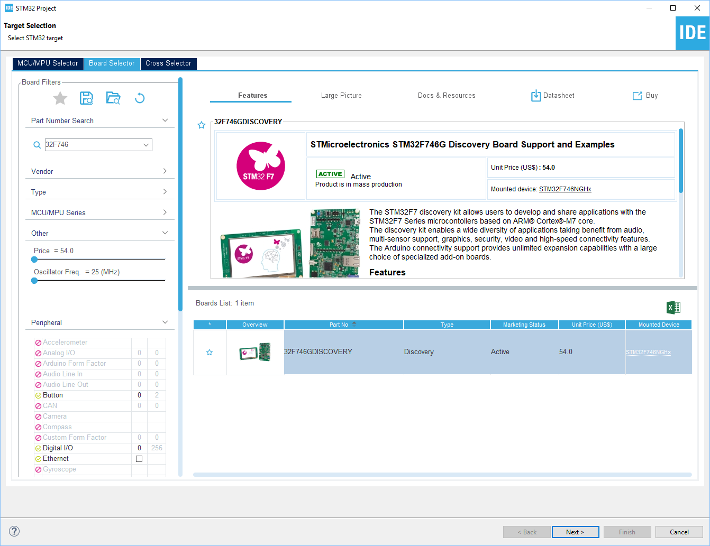
   Assign Project Name and suggest to keep "Use default location" checked, then press "Finish" button:
   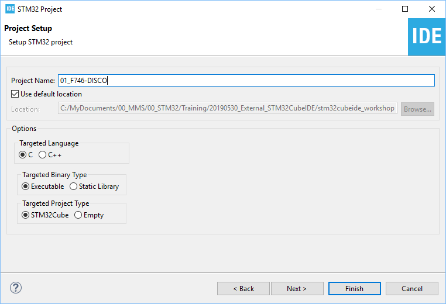

   Press "NO" for the following dialog:
   

   Press "YES" for the following dialog and suggest to check "Remember my decision":
   

   The initialization may take some time:
   

   The Project Creation may also take some time:
   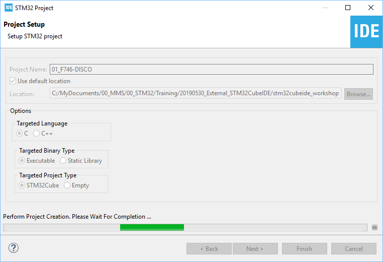
   
   
   
4. In IOC editor, please search for PI1 pin and set it to GPIO_Output
   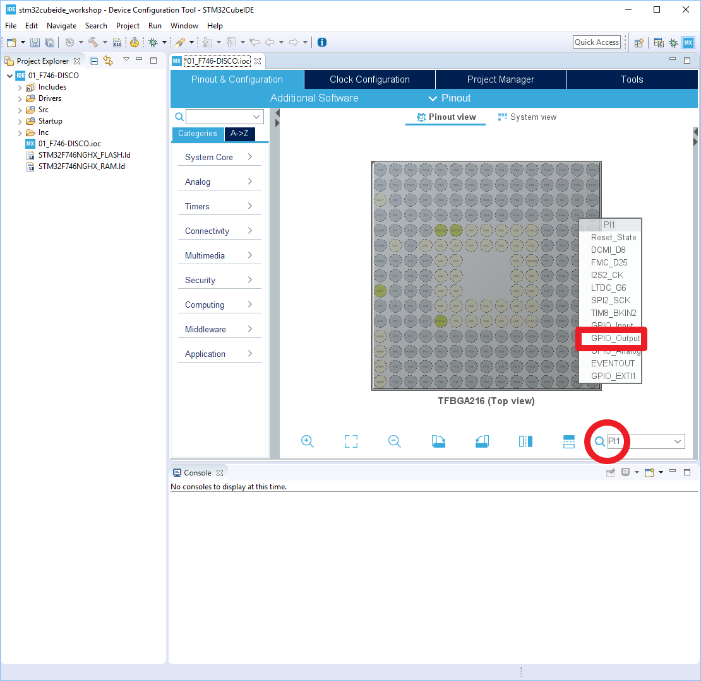

5. Add the following code to toggle LED LD1 (controlled by PI1) inside USER CODE Block 3 inside main()
   
```c
       /* USER CODE BEGIN 3 */
       HAL_Delay(500);
       HAL_GPIO_TogglePin(GPIOI, GPIO_PIN_1);
     }
     /* USER CODE END 3 */
```

   

6. Press the following button to generate code:
   
   
   
   
7. Right click on project icon and then select "Build Project":
   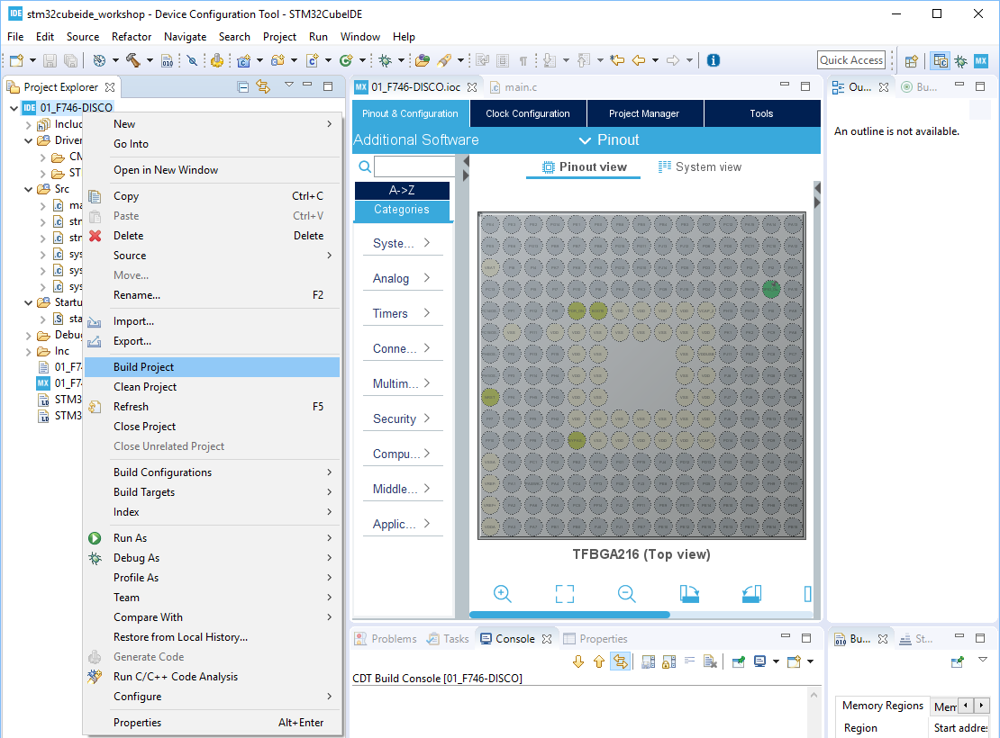
   
   
   
8. Start to run debug

   * Right click on project icon and then select "Debug As --> 2 STM32 MCU C/C++ Application":
     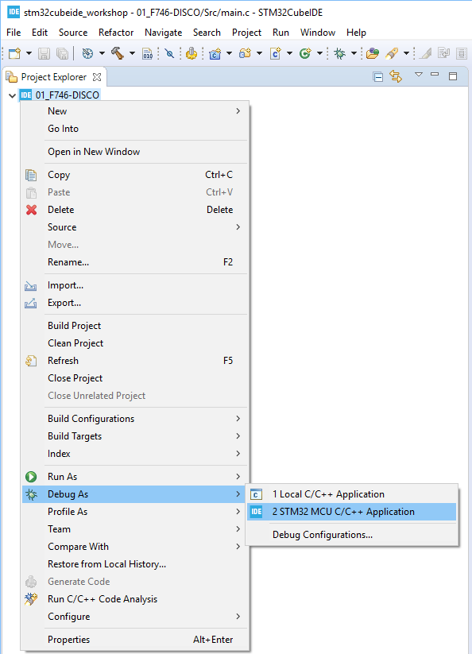

   * Press "OK" in this dialog:

     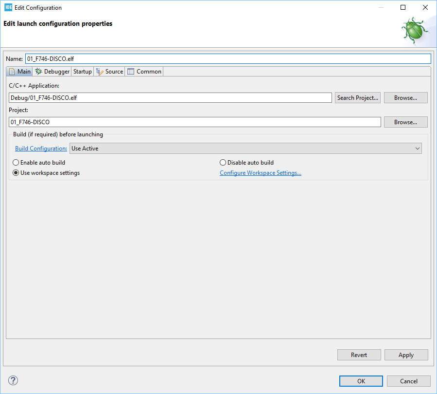

   * Press "Switch" button and suggest to check "Remember my decision":
     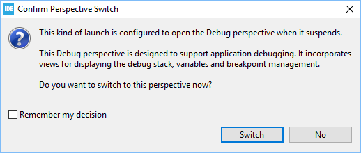
   
   
   
9. After switching to debug perspective, press "Resume" button to run your code:
   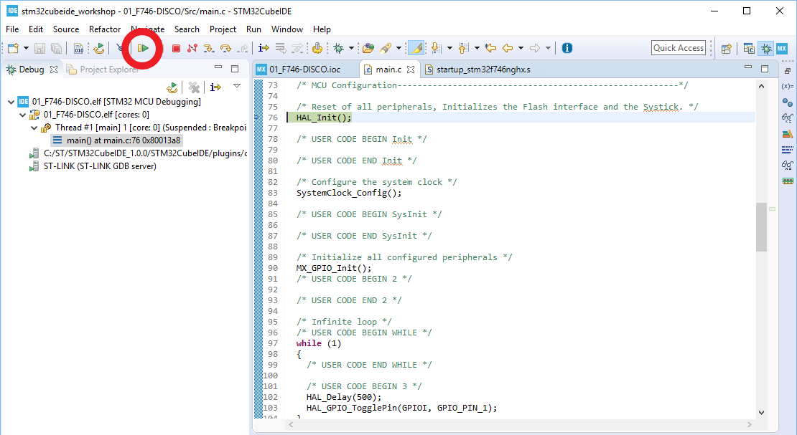
