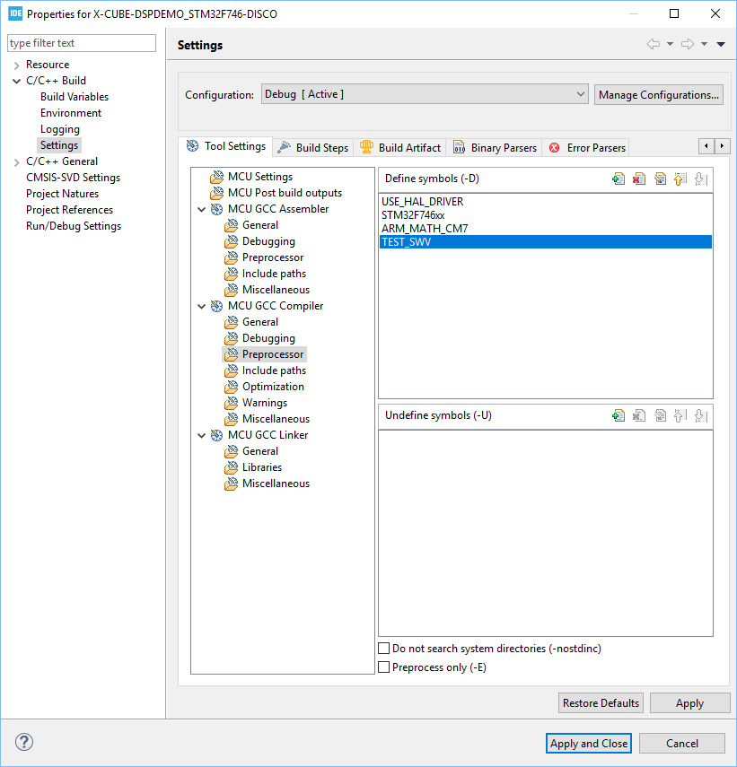
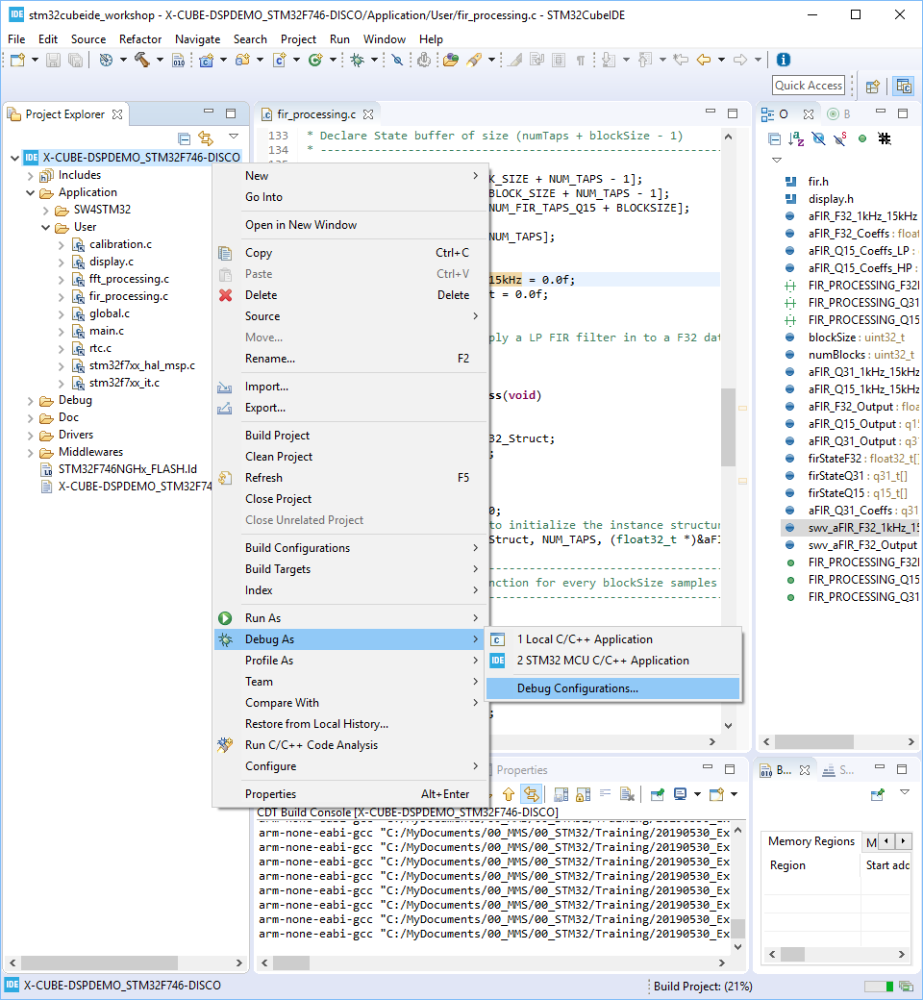
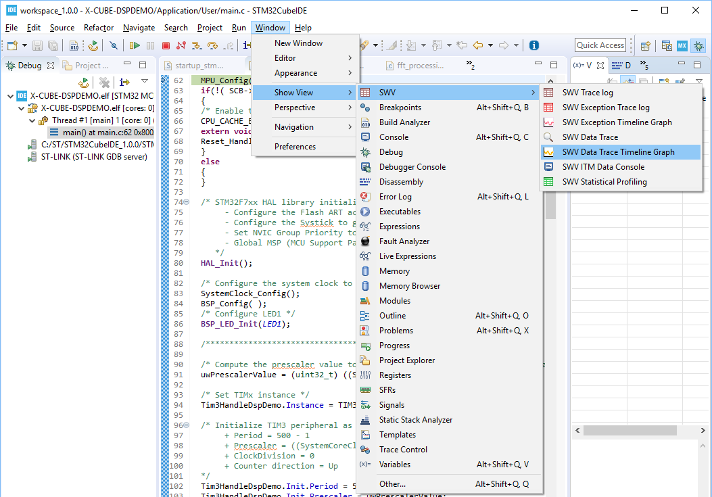
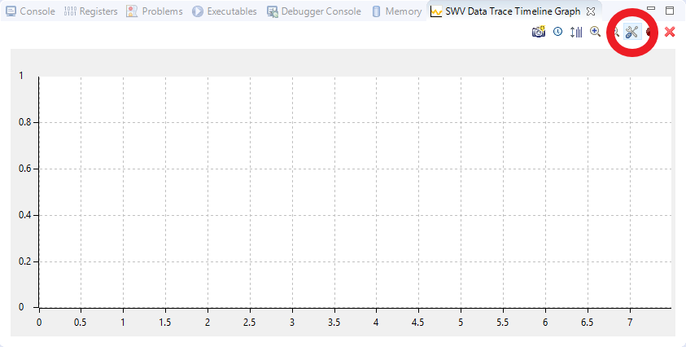
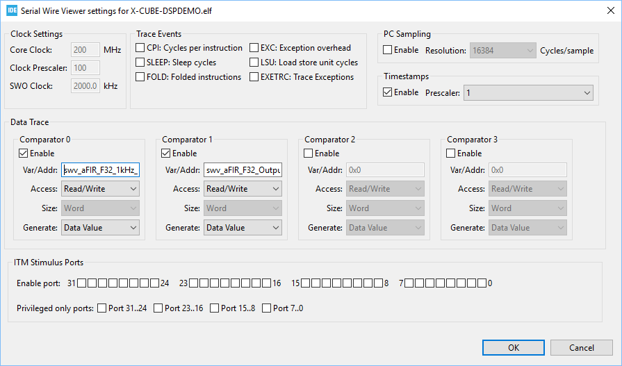
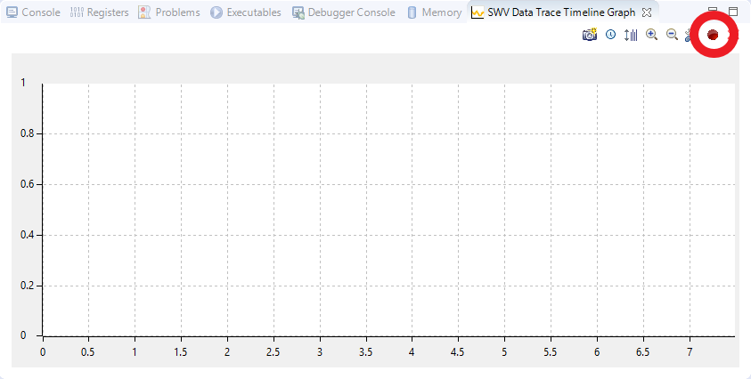
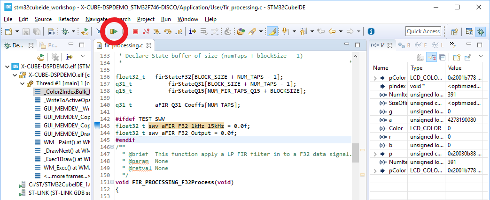
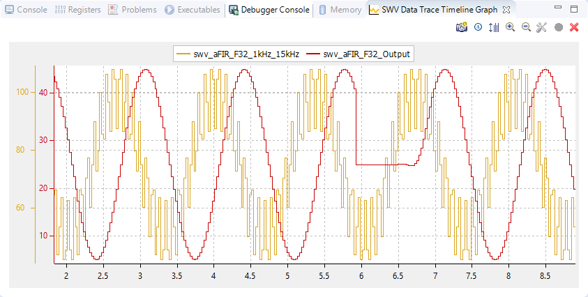

# Hands-on: X-CUBE-DSPDEMO

1. Import this reference project into STM32CubeIDE and then "Build Project".

2. Run/Debug to see how this demo works.

3. Add the code below in fir_processing.c

   ```C
#ifdef TEST_SWV
   float32_t swv_aFIR_F32_1kHz_15kHz = 0.0f;
   float32_t swv_aFIR_F32_Output = 0.0f;
   #endif```
   ```
   
4. Modify the code below (enclosed by #ifdef TEST_SWV, #else and #endif) inside FIR_PROCESSING_F32Process() definition in fir_processing.c under Src\:
   ```C
void FIR_PROCESSING_F32Process(void)
{ 
     ...
     GUI_USE_PARA(DataID);
#ifdef TEST_SWV
     swv_aFIR_F32_1kHz_15kHz = aFIR_F32_1kHz_15kHz[counter_FIR_Dd]*25 + 75;
     GRAPH_DATA_YT_AddValue(aGraph_Data[1], swv_aFIR_F32_1kHz_15kHz);
   #else
     GRAPH_DATA_YT_AddValue(aGraph_Data[1], (aFIR_F32_1kHz_15kHz[counter_FIR_Dd])*25 + 75);
   #endif

     if (++counter_FIR_Dd == GUI_COUNTOF(aFIR_F32_1kHz_15kHz))
     {
       counter_FIR_Dd = 0;
     }

   #ifdef TEST_SWV
     swv_aFIR_F32_Output = (aFIR_F32_Output[counter_FIR_Ds])*20 + 25;
     GRAPH_DATA_YT_AddValue(aGraph_Data[0], swv_aFIR_F32_Output);
#else
     GRAPH_DATA_YT_AddValue(aGraph_Data[0], (aFIR_F32_Output[counter_FIR_Ds])*20 + 25);
   #endif

     if (++counter_FIR_Ds == GUI_COUNTOF(aFIR_F32_Output))
     {
       counter_FIR_Ds = 0;
     }
   }
   ```
   
   
   
5. Define TEST_SWV in as shown below and then build project:

   
   
   
   
6. Setup "Debug Configuration"

   * Right click on project, select "Debug As --> Debug Configuration" as shown below
     
     
     
     
     
   * Go to "Debugger" tab, check "Enable" and then set Core Clock 200MHz as shown below:

     

   

7. Run Debug again and do not press "Resume" button yet.

8. Setup SWV Data Trace Timeline Graph

   * Select "Window --> Show View --> SWV --> SWV Data Trace Timeline Graph" to Enable SWV Data Trace Timeline Graph view as shown below

     
   
   
   
   * Press "Configure Trace " button as shown below:
     
   
   
   
   * Add "swv_aFIR_F32_1kHz_15kHz" and "swv_aFIR_F32_Output" in Var/Addr of Comparator 0 and 1 as shown below:
     
   
   
   
   * Press "Start Trace" button as shown below:
     
   
   
   
9. Press "Resume" button and you will see waveform in SWV Data Trace Timeline Graph aligned with that in LCD:
   
   

   

## Some More Features Worth Trying

1. SWV: Trace Log / SWV: ITM Timeline Graph
2. SWV: Exception Trace Log
3. SWV: Statistical Profiling
4. Dynamic printf